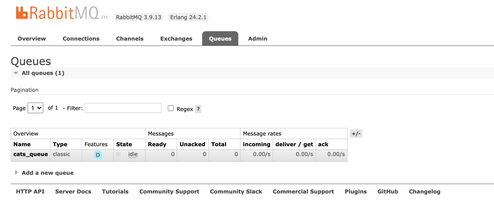

# microservices with RabbitMQ


## requirements

rabbitMQ docker

```
$ docker-compose up -d
```

you can checkout the rabbitMQ management web at http://localhost:15672/



there you can see all the queues you have and all the messages in them.

## running the project

after running the rabbitmq service you need to go to each folder
`gateway` and `microservice` and start using

```
$ yarn start
```

then all you need to do is send Get request to the gateway
there are two requests:

- http://localhost:3001/sendNormalEvent
- http://localhost:3001/sendLongEvent

the normal event just sends the event to the microservice and on the microservice side we just print the data.

and on the long event we send to the microservice an event and on the microservice side we wait for 10 seconds (simulating a job that takes time) and then print the data

two special rabbitmq configurations that we are using are:

- **noAck** - we must manually acknowledge when we have finished working with a message from the queue, only after the acknowledgment the message is deleted from the queue.
- **prefetchCount** - this way a consumer can proses only one message at a time, allowing for fair dispatch between multiple listeners.

you can run multiple microservices and send alot of long events (that take 10 sec) and play around. you can kill one of the instances in the middle of the waiting and see how the message does not disappear from the queue and another consumer takes it instead.

https://www.notion.so/lagunahealth/microservice-communication-eabde6c23798425b949d36e4f0206615#b074931f04a34c769fa71246b3f4d0b2
